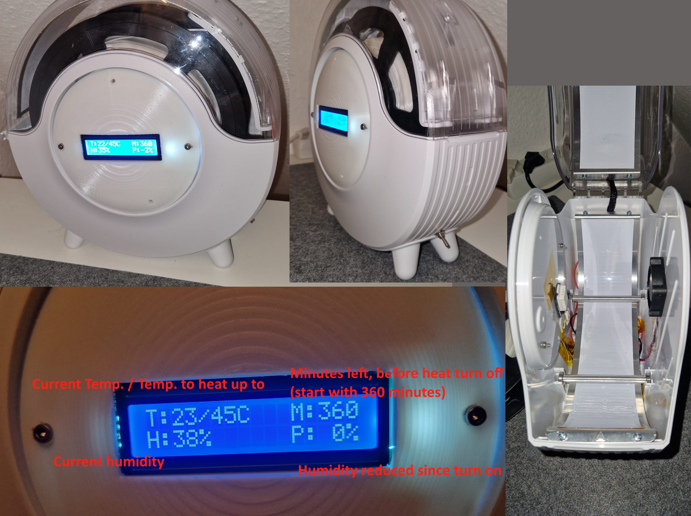
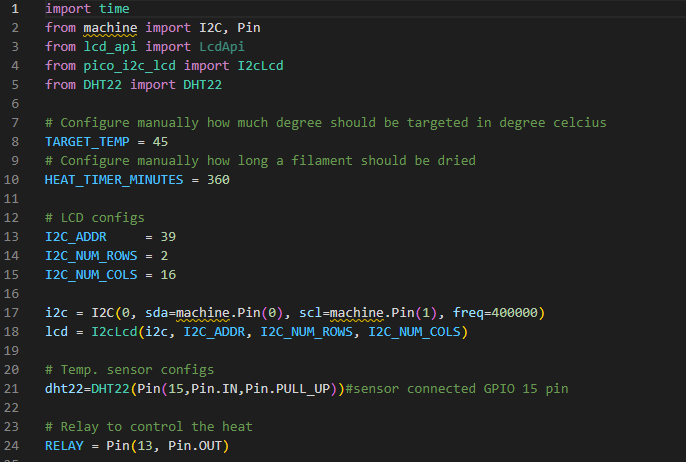

# FilamentDryer
I repaired and thereby improved an filament dryer with some parts I had lying around. It's based around a raspberry pi pico and therefore, programmed with micropython



# Components used

- Raspberry Pi Pico
- I2C LCD 1602 module
- Relay
- DHT22 temperature & humidity sensor
- Electric Switch
- Voltage converter (set to convert 24V -> 5V for Raspberry / Sensors / Fan)
- 24V power adapter + 24V heating elements (from filament dryer)

# Settings

The system can simply be configured in the first few lines of code in main.py:



- TARGET_TEMP is the temperature in °C to which the dryer will try to heat up to.
- HEAT_TIMER_MINUTES is the time in mintues for which the dryer will heat the chamber. After the time has passed, it will turn of the heating elements.


# How it works

When powered on, the fan will start spinning. 
The System checks if the current temperature is below the TARGET_TEMP and if so, it will turn on the heating elements.
It then will toggle the heating elements on and off, using the relay and thus hold the target temperature. The minute timer in the bottom right corner will count down and when it reaches 0, the heating elements will get deactivated.
To turn them on again, the dryer has to be reset (turn off and on again).

# Wiring and PIN setup

| Modfule | PIN |
|-|-|
| LCD | SDA=0, SCL=1 |
| Relay | 13 |
| Sensor | 15 |

>Note that the I2C_ADDR (line 13 screenshot above) can be found out with the following lines of code, executed on the pi pico:

```python
import machine
sda = machine.Pin(0)
scl = machine.Pin(1)
i2c = machine.I2C(0,sda=sda,scl=scl, freq=400000)
print(i2c.scan())
```

